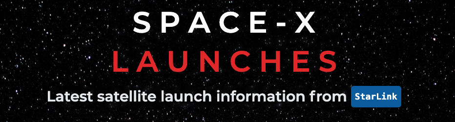

<div align='center'>
Built By
<a href="https://github.com/hassanmt96">Hassan Tariq</a> &
<a href="https://github.com/clayreinhardt">Clayton Reinhardt</a>
</div>


Fully designed to bring your attention to the latest updates in the future of our humanity.

This application was designed for nerds and space enthusiasts to track the latest updates in satellite data.

## **Usage & Technolgies**

```
Navigate to the Launches page to get updates on the latest internet constellations.

This application was rendered using the technologies of NextJS, React, TailwindCSS, ThreeJS, & Apollo GraphQL.

```

## **Getting Started**

- To get started using this application, clone the application & run the following commands:

  - `$ npm install` or `$ yarn`
  - `$ npm dev` or `yarn dev`

## **Configuration**

TailwindCSS

- Tailwind has a utility based styling approach
  - This helps with responsive breakpoints
- ThreeJS allows for the rendition of 3d components on a webpage
  - This helps provide fluidity and physics for all of the simulations of Starlink Data.

ThreeJs

- Our rendition of the planetary system is focused on tracking and highlighting satellites by name or individual clicks.
- 3D engine allows for drawing of simulated satellite points.

NextJS

- For speed and flexibilty NextJS was an obvious choice.
- One of the nice features of our application was the use case of `getStaticProps` for obtaining launch data.

```jsx
export async function getStaticProps() {
  const query = recentLaunches;

  const {
    data: { launchesPast },
  } = await client.query({
    query,
  });
  return {
    props: {
      launches: launchesPast,
    },
  };
}
```

## **How to Contribute**

1. Give us a star! We appreciate your support and are working tirelessly everyday to become better developers.
2. Check out the live demo of our site [FindSpaceX](https://www.findspacex.com/)

## **The future and beyond**

- We do plan on bringing this site to a mobile app. In the meantime we are still debugging and running tests locally to give you guys the best user experience!
